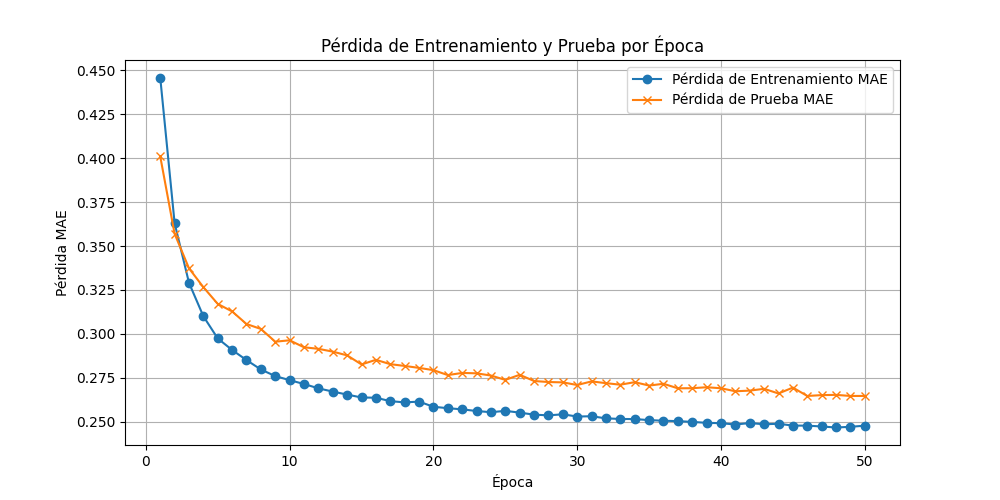

# Sistema de Recomendación de peliculas con Máquina de Boltzmann Restringida (RBM)


---

## Índice

- [Introducción](#introducción)
- [Características](#características)
- [Estructura del Proyecto](#estructura-del-proyecto)
- [Datos](#datos)
- [Instalación](#instalación)
- [Uso](#uso)
  - [Entrenamiento del Modelo](#entrenamiento-del-modelo)
  - [Generar Recomendaciones con un Modelo Pre-entrenado](#generar-recomendaciones-con-un-modelo-pre-entrenado)
- [Resultados](#resultados)
  - [Resultados del Entrenamiento](#resultados-del-entrenamiento)
  - [Gráficos Generados](#gráficos-generados)
- [Licencia](#licencia)

---

## Introducción

Este proyecto implementa un **Sistema de Recomendación** utilizando una **Máquina de Boltzmann Restringida (RBM)**. Basado en el conjunto de datos **MovieLens 1M** (https://grouplens.org/datasets/movielens/), el sistema es capaz de entrenar un modelo RBM, interactuar con el usuario para recopilar datos personales y valoraciones de películas, y generar recomendaciones personalizadas basadas en sus preferencias.

Cabe destacar que en este ejemplo he utilizado un conjunto de películas relativamente antiguas. En la misma página de GroupLens se encuentran disponibles datasets más actuales, como el de 32M, que incluye tanto series como películas. Sin embargo, este dataset no fue utilizado debido a limitaciones de hardware: al cargar los datos, el uso de memoria RAM excedía la capacidad de mi máquina, a pesar de contar con 32 GB de DDR5.
Si planeas escalar este proyecto o trabajar con datasets más grandes, asegúrate de disponer de un equipo con recursos suficientes.

La **RBM** es una red neuronal probabilística que se utiliza para modelar distribuciones de probabilidad. 

Recomiendo el curso **"Deep Learning de A a Z: Redes Neuronales en Python desde Cero"** (https://www.udemy.com/course/deeplearning/?couponCode=LETSLEARNNOW) en Udemy, donde adquirí una parte significativa de los conocimientos utilizados en este proyecto. Este curso es una excelente opción para quienes buscan adentrarse en el mundo del aprendizaje profundo de manera práctica y comprensible.

Además, he consultado los siguientes artículos académicos para complementar el desarrollo y comprensión técnica del proyecto:

1. [Deep Boltzmann Machines](https://www.utstat.toronto.edu/~rsalakhu/papers/dbm.pdf) - Salakhutdinov y Hinton.
2. [The Helmholtz Machine](https://www.gatsby.ucl.ac.uk/~dayan/papers/hdfn95.pdf) - Dayan, Hinton et al.
3. [Greedy Layer-Wise Training of Deep Networks](https://www.iro.umontreal.ca/~lisa/pointeurs/BengioNips2006All.pdf) - Bengio, Lamblin et al.
4. [A Fast Learning Algorithm for Deep Belief Nets](https://www.cs.toronto.edu/~hinton/absps/fastnc.pdf) - Hinton, Osindero et al.

---

## Características

- **Preprocesamiento de Datos**: Incluye funciones para cargar, limpiar y transformar los datos de MovieLens.
- **Entrenamiento del Modelo**: Implementa *Contrastive Divergence* para entrenar la RBM y optimizar sus parámetros.
- **Interfaz de Usuario**: Permite que los usuarios ingresen sus datos personales y valoraciones de películas.
- **Generación de Recomendaciones**: Proporciona recomendaciones personalizadas basadas en las preferencias del usuario.
- **Documentación Completa**: Incluye un notebook detallado (`rbm_paso_a_paso.ipynb`) que explica paso a paso el funcionamiento del modelo.

---

## Estructura del Proyecto

```
-----------/
├── data/
│   └── ml-1m/
│       ├── ratings.dat               # Archivo de valoraciones de películas
│       ├── movies.dat                # Información de las películas
│       ├── users.dat                 # Información demográfica de usuarios
│       ├── .Rhistory                 # Historial de comandos en R (no usado directamente)
│       ├── README                    # Información del dataset MovieLens 1M
│       ├── test_set.csv              # Conjunto de prueba creado externamente
│       ├── Train_Test_Set_Creation.R # Script en R para crear conjuntos de entrenamiento/prueba
│       └── training_set.csv          # Conjunto de entrenamiento creado externamente
├── models/
│   └── rbm.py                        # Implementación de la clase RBM
├── utils/
│   ├── data_preprocessing.py         # Funciones para cargar y procesar los datos
│   └── evaluation.py                 # Función para calcular métricas de evaluación
├── Recommender.py                    # Interfaz para recopilar datos y generar recomendaciones
├── main.py                           # Script principal para entrenar el modelo y generar recomendaciones
├── rbm_paso_a_paso.ipynb             # Notebook con explicaciones paso a paso
├── README.md                        
├── MovieLens.txt                     # Lista de profesiones
└── salida.txt                        # Salida generada tras ejecutar el sistema
```

---

## Instalación

### **1. Clonar el Repositorio**

Clona este repositorio en tu máquina local:

```bash
git clone https://github.com/moises60/Sistema_de_Recomendación_de_peliculas_con_Máquina_de_Boltzmann.git
cd Sistema_de_Recomendación_de_peliculas_con_Máquina_de_Boltzmann
```

## Uso

### **Entrenamiento del Modelo**

Para entrenar el modelo RBM, ejecuta el script `main.py`. Este script:

```bash
python main.py
```

**Pasos del Proceso:**

1. **Cargar Datos**: Se cargan las valoraciones, películas y características de usuarios desde los archivos en `data/ml-1m/`.
2. **Preprocesamiento**: Se mapean los IDs de películas, se binarizan las valoraciones y se concatenan las características de usuarios.
3. **Entrenamiento**: La RBM se entrena durante 50 épocas, optimizando los pesos para minimizar el Error Absoluto Medio (MAE).
4. **Visualización**: Se genera un gráfico que muestra la pérdida de entrenamiento y prueba a lo largo de las épocas.
5. **Guardar Modelo**: El modelo entrenado se guarda en `models/trained_rbm.pth`.
6. **Recomendaciones**: El sistema solicita datos personales y valoraciones al usuario, y genera recomendaciones basadas en el modelo.

## Resultados

### **Resultados del Entrenamiento**

Durante el entrenamiento, el modelo RBM muestra una disminución gradual en la pérdida tanto en el conjunto de entrenamiento como en el de prueba,
indicando que está aprendiendo a predecir las valoraciones de manera efectiva. Lo detengo en 50 épocas porque, a partir de las 30 o 40, ya le cuesta mucho mejorar.



### **Interacción con el Usuario**

Después del entrenamiento, el sistema solicita al usuario ingresar sus datos personales y valorar 20 películas. Basado en estas valoraciones y las características del usuario, el sistema genera 10 recomendaciones de películas.

**Ejemplo de Interacción:**

```plaintext
Archivo 'movies.dat' cargado exitosamente.

Por favor, ingresa tus datos personales:
Género (M/F): M
Edad: 21

Selecciona tu ocupación según el siguiente listado:
0: Otro o no especificado
1: Académico/Educador
2: Artista
...
20: Escritor

Ocupación (ID numérico entre 0 y 20): 12

Por favor, califica las siguientes películas (1-5 estrellas). Si no has visto la película, presiona Enter para omitir.
1. Mummy, The (1999): 5
2. Hi-Lo Country, The (1998):
Película omitida.
...
20. Gremlins (1984):
Película omitida.

Las siguientes películas son recomendadas para ti:
- Shawshank Redemption, The (1994) (Drama)
- Schindler's List (1993) (Drama|War)
- ...
```

## Licencia

**Licencia MIT**.
